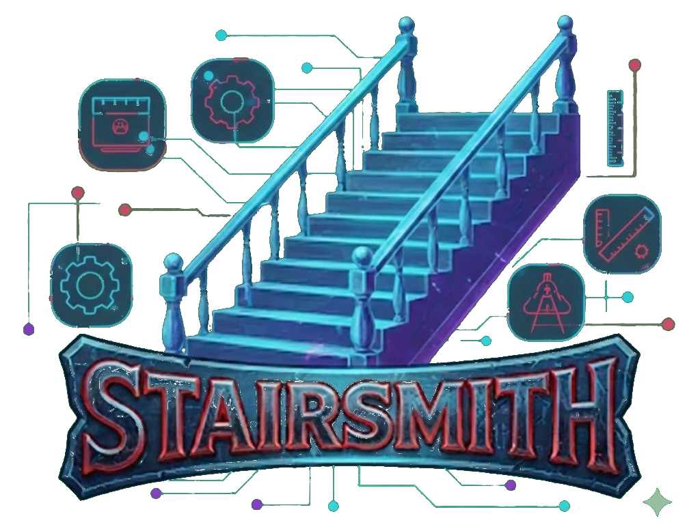
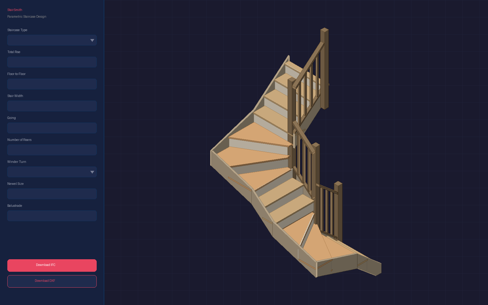

  

  # StairSmith

  **A free staircase design tool that runs entirely in your browser.**

  

  

  [Open StairSmith](https://jakewhitearchitecture.com/stairsmith/)

---

## What it does

StairSmith is a free, browser-based staircase design tool for timber staircases. You set a handful of dimensions, choose a layout, and the tool builds a full parametric 3D model that updates live as you adjust. When the design is right, download it as an IFC4 model for BIM coordination or a dimensioned DXF drawing for CAD.

It covers the stair types most common in UK residential construction: straight flights, quarter-turn single winder (L-shape), half-turn double winder (U-shape), and half-landing U-shape. Winder treads use traditional kite winder setting-out with newel posts at each turn. Balustrade, stringers, handrails, baserails and spindles are all modelled.

StairSmith is not a stair calculator. It does not return a single number; it models and exports real geometry. It does display rise, going, pitch, total height and stair width as reference values, so you can see the key dimensions at a glance, but those values are for information only. It does not check or assure compliance with building regulations.

## Who it is for

StairSmith serves two audiences:

- **Homeowners, self-builders and renovators** looking for a free online stair design tool to visualise a wooden staircase for a new build, extension, loft conversion or renovation. No download, no login, no account needed.
- **Architects, architectural technologists, designers and BIM coordinators** who need a quick parametric 3D staircase model with proper IFC4 output, Uniclass 2015 classification, stable GUIDs and property sets, ready to drop into a federated BIM model or a dimensioned CAD drawing set.

## Key features

- **Four stair types:** straight flight, single winder (quarter-turn, L-shape), double winder (half-turn, U-shape), and half-landing (U-shape with a flat intermediate landing).
- **Live 3D preview** with orbit, zoom, pan, a point-to-point measure tool, and an auto-rotate view.
- **Kite winder setting-out** with configurable newel posts, winder X and winder Y dimensions.
- **Full balustrade modelling:** stringers, handrails, baserails and spindles, with independent left and right side conditions (wall or balustrade).
- **Flight distribution control** to move treads between flights and balance the design.
- **Mirror button** to flip the staircase hand without re-entering dimensions.
- **IFC4 export:** a complete spatial model (IfcProject, IfcSite, IfcBuilding, IfcBuildingStorey, IfcStair, IfcStairFlight) with materials, Pset_StairCommon, Pset_StairFlightCommon, Uniclass 2015 classification and deterministic GUIDs.
- **DXF export:** dimensioned plan view, four orthographic elevations and stepped sections.
- **Share image:** capture and share a screenshot of the current design directly from the tool.
- **Reference values on screen:** rise, going, pitch, total height and stair width are displayed live for the designer's information.
- **No server, no backend:** the entire tool runs client-side in your browser. Nothing is uploaded, nothing is stored.

## How it works

You open the page, pick a stair type, enter your floor-to-floor height, number of risers, going, stair width and component thicknesses, and StairSmith builds the 3D model live. Adjust any parameter and the preview updates instantly. When you are satisfied, click "Download IFC File" or "Download DXF Plan" to export.

Under the hood, the geometry engine is written in Python and runs in the browser via Pyodide (CPython compiled to WebAssembly). The 3D viewport uses Three.js. IFC authoring uses IfcOpenShell (also running as a WASM wheel in the browser). 2D geometry operations for winder set-out, DXF sections and elevations use Shapely. No server-side compute is involved at any point.

The same Python modules produce both the live preview and the exported files: the UI passes a parameter set to Python, which returns a shared mesh list consumed identically by the preview renderer, the DXF generator and the IFC generator.

## Why it is free

StairSmith was built by [Jake White Architecture](https://jakewhitearchitecture.com) as a practical tool for the practice's own design work and shared openly for anyone to use. There is no paywall, no gated quote form, no upsell, no freemium tier. The source code is available under the Apache 2.0 licence.

## Exports explained

### IFC4

The IFC export produces a valid IFC4 file (buildingSMART ISO 16739-1) with a proper spatial hierarchy: IfcProject, IfcSite, IfcBuilding, IfcBuildingStorey, IfcStair, and IfcStairFlight containers. Individual elements (treads, risers, winder slabs, landings, stringers, handrails, baserails, spindles, newel posts) are mapped to their correct IFC entity types (IfcSlab, IfcRailing, IfcMember, IfcColumn). Each element carries material assignments, standard property sets (Pset_StairCommon, Pset_StairFlightCommon) and Uniclass 2015 classification references.

GUIDs are deterministic: re-exporting the same design produces the same GlobalIds, so downstream BIM coordination workflows can track elements across revisions. An element's GUID changes only when its own geometry changes.

This means you can drop the IFC file into Autodesk Revit, Solibri, BIMcollab, Navisworks, Trimble Connect or any other IFC-capable BIM viewer and get a properly structured staircase model, not just dumb geometry.

### DXF

The DXF export produces a dimensioned plan view, four orthographic elevations (front, back, left, right) and stepped sections through the staircase. The output is DXF R12 (AC1009) for maximum compatibility with AutoCAD, BricsCAD, LibreCAD and any other CAD software that reads DXF.

Dimensions are annotated directly on the drawing. For winder types, the plan includes the winder tread set-out geometry. For the half-landing type, the plan includes the landing extent and overall width across both flights.

## Getting started

1. Open [jakewhitearchitecture.com/stairsmith](https://jakewhitearchitecture.com/stairsmith/) in any modern browser.
2. Read and accept the Terms of Use.
3. Choose a stair type from the dropdown: Straight Flight, Single Winder (L-shape), Double Winder (U-shape) or Half-Landing (U-shape).
4. Set your floor-to-floor height, number of risers, going, stair width and component thicknesses.
5. For winder types, configure the corner(s): enable or disable each turn and adjust the winder X and Y dimensions.
6. For the half-landing type, adjust the landing width oversize if you need a wider landing than the default.
7. Use the flight distribution controls to balance treads between flights.
8. Choose the left and right side conditions (wall or balustrade) and adjust handrail, baserail and spindle dimensions.
9. Use the "Mirror Staircase" button to flip the hand if needed.
10. Orbit, zoom and pan the 3D preview. Use the measure tool (press M or tap the measure button) to check point-to-point distances.
11. Check the reference values overlay: rise, going, pitch, total height and stair width.
12. Click "Download IFC File" for a BIM model or "Download DXF Plan" for dimensioned CAD drawings.

No download, no installation, no login and no account required. Everything runs locally in your browser.

## Limitations

StairSmith is a design aid for timber staircases. It has clear boundaries:

- **Timber only.** It does not model concrete, steel, glass, stone or metal staircases.
- **No helical or spiral staircases.** It covers straight, winder and half-landing layouts only.
- **Not a compliance check.** It displays rise, going and pitch as reference values only. It does not verify compliance with Approved Document K or any other building regulation. All outputs must be independently checked and verified by a competent person.
- **Not a structural check.** It models geometry, not loading. Structural adequacy is the designer's responsibility.
- **Not a stair calculator.** It produces 3D geometry and exported files, not a single-number answer.
- **Desktop browsers recommended.** The tool works on mobile but the full parameter panel and 3D viewport are designed for a desktop or laptop screen.
- **Internet connection required on first load.** Pyodide, Three.js and the IfcOpenShell wheel are loaded from CDNs. Once cached by the browser, subsequent visits are faster.

## Technology and licence

| Component | Technology |
|-----------|------------|
| UI and 3D viewport | HTML, CSS, JavaScript, [Three.js](https://threejs.org/) r128 |
| Geometry engine | Python via [Pyodide](https://pyodide.org/) (CPython compiled to WebAssembly) |
| 2D geometry | [Shapely](https://shapely.readthedocs.io/) (GEOS) |
| IFC authoring | [IfcOpenShell](https://ifcopenshell.org/) (WASM wheel) |

Licensed under the [Apache License 2.0](LICENSE). Copyright 2025 Jake White Architecture.

If you reuse or build on this code, please retain the [`NOTICE`](NOTICE) file and acknowledge the original repository.

## Links

- **Live tool:** [jakewhitearchitecture.com/stairsmith](https://jakewhitearchitecture.com/stairsmith/)
- **Jake White Architecture:** [jakewhitearchitecture.com](https://jakewhitearchitecture.com)
- **Designing Buildings Wiki article:** [designingbuildings.co.uk/wiki/Stairsmith](https://www.designingbuildings.co.uk/wiki/Stairsmith)
- **Source code:** [github.com/JakeWhiteArchitecture/3Dstaircreator](https://github.com/JakeWhiteArchitecture/3Dstaircreator)

## FAQ

### Is StairSmith free?

Yes. StairSmith is completely free to use. There is no paywall, no trial period, no account required and no limit on how many staircases you design or export. The source code is open under the Apache 2.0 licence.

### Do I need to install anything or create an account?

No. StairSmith runs entirely in your browser. There is nothing to download, nothing to install and no account or login to create. Open the page and start designing.

### What file formats does it export?

StairSmith exports two formats: IFC4 and DXF. The IFC4 file is a full BIM model with spatial hierarchy, materials, property sets, Uniclass 2015 classification and stable GUIDs. The DXF file contains a dimensioned plan, four elevations and stepped sections, in DXF R12 format compatible with all major CAD software.

### Does it export IFC?

Yes. StairSmith exports valid IFC4 files following the buildingSMART ISO 16739-1 standard. The model includes IfcStair and IfcStairFlight containers, with individual treads, risers, landings, stringers, handrails and newel posts mapped to their correct IFC entity types. GUIDs are deterministic, so the same design always produces the same identifiers for downstream BIM coordination.

### What stair types does it support?

StairSmith supports four timber stair types: straight flight, single winder (quarter-turn, L-shape), double winder (half-turn, U-shape), and half-landing (U-shape with a flat intermediate landing).

### Can it do a staircase with a landing or winders?

Yes. The double winder type produces a U-shaped staircase with kite winder treads at each turn. The half-landing type produces a U-shape with a flat intermediate landing instead of winders at the halfway point. The single winder type produces an L-shaped staircase with a quarter-turn of kite winders at one corner.

### Does it check building regulations or Part K?

No. StairSmith displays rise, going and pitch as on-screen reference values for information only. It does not check or assure compliance with Approved Document K or any other building regulation. The tool will let you model a staircase that does not comply. All designs must be independently checked and verified by a competent person before use.

### Is it a stair calculator?

StairSmith is a parametric 3D modelling tool, not a stair calculator in the traditional sense. It does not simply return a number. It builds full 3D geometry and exports it as IFC4 or DXF. It does display rise, going, pitch, total height and width as reference values, but its purpose is to model and export, not to calculate.

### Can I use it for a loft conversion?

Yes. StairSmith is well suited to designing a timber staircase for a loft conversion, extension, new build, self-build or renovation. Set the floor-to-floor height, choose a stair type that fits the available space, adjust the dimensions to suit, and export the result.

### Is the source code available and what licence is it under?

Yes. The full source code is available on [GitHub](https://github.com/JakeWhiteArchitecture/3Dstaircreator) under the [Apache License 2.0](LICENSE). You are free to use, modify and redistribute it, provided you retain the licence and notice files.

---

Built by [Jake White Architecture](https://jakewhitearchitecture.com).

If you find StairSmith useful, you can [buy me a coffee](https://buymeacoffee.com/jakewhite).
